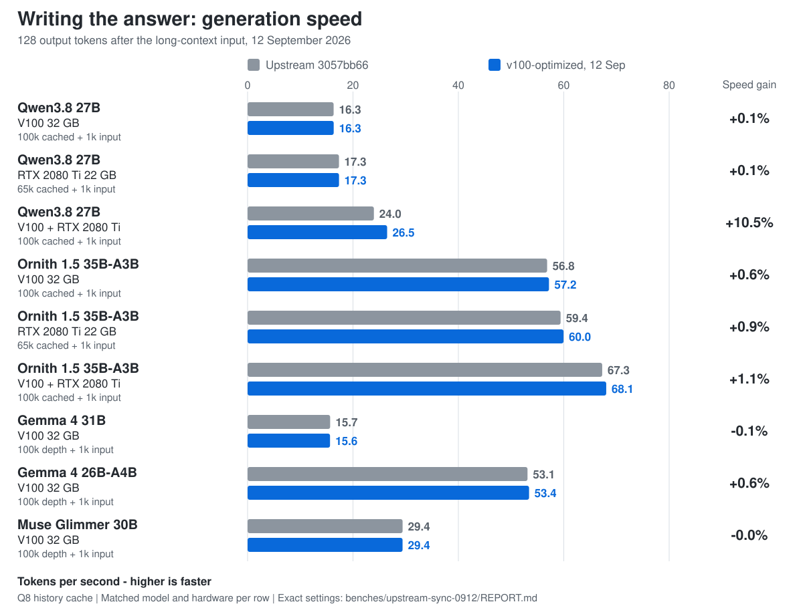

# llama.cpp for V100 and RTX 2080 Ti

CUDA paths tuned for long-context inference on NVIDIA **Volta (SM70)** and **Turing (SM75)**. The branch is tested on a Tesla V100-SXM2 32 GB and an RTX 2080 Ti 22 GB, both separately and together.


The headline measurements are against current upstream `3057bb66` after syncing the fork on 2026-09-12. The largest prompt-processing gains are **+71.4%** for Qwen on V100 + RTX 2080 Ti, **+47.4%** for Qwen on one V100, **+40.1%** for Ornith on one V100, **+40.1%** for Gemma 4 31B, and **+37.7%** for Gemma 4 26B-A4B. Muse Glimmer gains **+9.1%** from the generic Q4_K work plus its D128/GQA16 attention specialization.



Decode is intentionally close to upstream on most single-GPU workloads. The main generation gain is the mixed Qwen setup at **+10.5% TG**; the other headline rows are approximately neutral to +1%.

## Build and run

### Build

Clone and build one binary containing both SM70 and SM75 kernels:

```bash
git clone --branch v100-optimized --single-branch https://github.com/mistrjirka/llama.cpp.git
cd llama.cpp
cmake -S . -B build -G Ninja -DCMAKE_BUILD_TYPE=Release -DGGML_CUDA=ON -DGGML_CUDA_GRAPHS=ON -DCMAKE_CUDA_ARCHITECTURES='70;75' -DLLAMA_BUILD_UI=OFF
cmake --build build -j --target llama-server
```

`70;75` produces kernels for both GPUs. `-DLLAMA_BUILD_UI=OFF` avoids the UI download/build; remove it if you use the built-in web UI.

The normal CUDA build is recommended for Qwen and V100-only Ornith. For routed MoE experts on V100, set `GGML_CUDA_VOLTA_FORCE_MMQ=moe`. RTX-only and mixed-GPU Ornith use the dedicated FORCE_MMQ build shown below.

### Qwen on one V100

For Qwen3.8-27B, the server selects the measured `batch=4096`, `ubatch=4096` defaults at a 131072-token context when `-b/-ub` are omitted. Verify device names with `./build/bin/llama-server --list-devices`.

```bash
./build/bin/llama-server \
  --model /path/to/Qwen3.8-27B-UD-Q5_K_XL.gguf \
  --device CUDA0 --split-mode none \
  --gpu-layers all \
  --ctx-size 131072 --parallel 1 \
  --flash-attn on \
  --cache-type-k q8_0 --cache-type-v q8_0
```

### Qwen on one RTX 2080 Ti

The tested 22 GB RTX setup uses `batch=4096`, `ubatch=2048`.

```bash
./build/bin/llama-server \
  --model /path/to/Qwen3.8-27B-UD-Q5_K_XL.gguf \
  --device CUDA0 --split-mode none \
  --gpu-layers all \
  --ctx-size 67584 --parallel 1 \
  --flash-attn on \
  --batch-size 4096 --ubatch-size 2048 \
  --cache-type-k q8_0 --cache-type-v q8_0
```

### Qwen on V100 + RTX 2080 Ti

The tested production-style setup uses a 409600-token YaRN context and a 4:5 RTX:V100 tensor split. The example assumes the RTX is `CUDA1` and the V100 is `CUDA0`.

```bash
export GGML_CUDA_ALLREDUCE=internal
export GGML_CUDA_AR_COPY_THRESHOLD=131072

./build/bin/llama-server \
  --model /path/to/Qwen3.8-27B-UD-Q5_K_XL.gguf \
  --device CUDA1,CUDA0 --tensor-split 4,5 --split-mode tensor \
  --gpu-layers all --fit off --parallel 1 \
  --ctx-size 409600 \
  --override-kv qwen35.context_length=int:409600 \
  --rope-scaling yarn --rope-scale 1.5625 --yarn-orig-ctx 262144 \
  --flash-attn on \
  --batch-size 4096 --ubatch-size 2048 \
  --cache-type-k q8_0 --cache-type-v q8_0 \
  --ctx-checkpoints 32 --checkpoint-min-step 8192
```

### Qwen batch defaults

| Setup | Default | Selection |
|---|---:|---|
| V100, 131072 ctx | `4096/4096` | automatic |
| RTX 2080 Ti, 32768 or 67584 ctx | `4096/2048` | automatic |
| V100 + RTX 2080 Ti, 409600 ctx | `4096/2048` | automatic |
| Other model/topology/context | upstream behavior | unchanged |

Explicit `-b/-ub`, `LLAMA_ARG_BATCH`/`LLAMA_ARG_UBATCH`, and configuration values take precedence. `LLAMA_V100_AUTO_BATCH=0` disables the hardware-aware defaults.

## Current upstream comparison

Server rows restore the same validated prefix, append 1,000 tokens, then generate 128 tokens. Gemma and Muse use `llama-bench -d 100000 -p 1000 -n 128` so the 100k state is outside the timed append. For V100 MoE rows, upstream is given its faster available global FORCE_MMQ build while the fork uses its more selective `GGML_CUDA_VOLTA_FORCE_MMQ=moe` policy; dense models stay on normal dispatch. Full commands, A-B-B-A controls, hashes, standard deviations, logs, and sync validation are in [`benches/upstream-sync-0912/REPORT.md`](benches/upstream-sync-0912/REPORT.md).

| Workload | Upstream PP | `v100-optimized` PP | PP gain | TTFT reduction | TG gain |
|---|---:|---:|---:|---:|---:|
| Qwen3.8 27B · V100 · 100k+1k | 298.47 | **440.08** | **+47.45%** | **-31.61%** | +0.08% |
| Qwen3.8 27B · RTX 2080 Ti · 65k+1k | 383.73 | **493.53** | **+28.61%** | **-21.67%** | +0.05% |
| Qwen3.8 27B · V100+RTX · 100k+1k | 405.93 | **695.92** | **+71.44%** | **-40.71%** | **+10.49%** |
| Ornith 1.5 35B-A3B · V100 · 100k+1k | 696.70 | **976.39** | **+40.15%** | **-27.75%** | +0.62% |
| Ornith 1.5 35B-A3B · RTX 2080 Ti · 65k+1k | 1317.78 | **1560.49** | **+18.42%** | **-14.92%** | +0.94% |
| Ornith 1.5 35B-A3B · V100+RTX · 100k+1k | 1208.72 | **1474.71** | **+22.01%** | **-17.19%** | +1.14% |
| Gemma 4 31B · V100 · 100k depth + 1k | 201.67 | **282.56** | **+40.11%** | — | -0.15% |
| Gemma 4 26B-A4B · V100 · 100k depth + 1k | 691.68 | **952.20** | **+37.66%** | — | +0.55% |
| Muse Glimmer 30B · V100 · 100k depth + 1k | 550.54 | **600.86** | **+9.14%** | — | -0.02% |

The Qwen V100/dual and all Ornith rows reproduced the same token hashes between upstream and current. Qwen RTX was stable within each arm but produced different upstream/current sequences; the performance comparison does not depend on token identity.

## What this fork changes

The user-facing performance work is concentrated in a few areas:

- **Volta long-context attention:** tuned Q8-backed FlashAttention paths, including D128/GQA16 for Muse and D512 for Gemma.
- **Volta quant conversion:** SM70-specialized FP16 conversion for Q2_K, Q3_K, Q4_K, Q5_K, Q6_K, and MXFP4. The retained real-model regression matrix showed gains for every targeted format and no material change on an unrelated PXQ4-HQ control.
- **Turing long-Q8 attention:** long-prompt specialization plus INT8 Tensor-Core QK on validated SM75 geometries.
- **MoE dispatch:** selective Volta MMQ for routed experts and dedicated FORCE_MMQ builds where that is faster on RTX/mixed Ornith.
- **Mixed-GPU serving:** internal CUDA all-reduce and tuned tensor/layer placement for V100 + RTX 2080 Ti.
- **Serving features:** MTP, exact-prefix KV sharing, multi-slot serving, and related long-context state handling.

Low-level kernel sweeps and rejected experiments are intentionally kept out of this README. See the benchmark reports for implementation details.

## Ornith and MoE

### V100

Use the normal build and enable MMQ only for routed experts:

```bash
export GGML_CUDA_VOLTA_FORCE_MMQ=moe
```

This is safe in a shared Qwen/Ornith launcher: dense Qwen measured within ~0.2% of the selector being unset, while globally forcing MMQ is much slower for dense Qwen. On the fresh V100 Ornith control, selective `MMQ=moe` reached **976.39 tok/s** versus **943.65 tok/s** with global FORCE_MMQ.

### RTX 2080 Ti and mixed Ornith

For the tested RTX-only and V100+RTX Ornith configurations, both comparison arms use a dedicated FORCE_MMQ build:

```bash
cmake -S . -B build-ornith-mmq -G Ninja -DCMAKE_BUILD_TYPE=Release -DGGML_CUDA=ON -DGGML_CUDA_GRAPHS=ON -DGGML_CUDA_FORCE_MMQ=ON -DCMAKE_CUDA_ARCHITECTURES='70;75' -DLLAMA_BUILD_UI=OFF
cmake --build build-ornith-mmq -j --target llama-server
```

Do not use this globally forced build for dense Qwen.

The headline Ornith configurations are:

| Setup | Model | Batch / ubatch | Placement |
|---|---|---:|---|
| V100 | AD-Q6_K/Q5_K | `2048/512` | V100 only, selective `MMQ=moe` |
| RTX 2080 Ti | AD-Q5_K/Q4_K | `4096/512` | RTX only, FORCE_MMQ build |
| V100 + RTX | AD-Q6_K/Q5_K | `2048/1024` | tensor split `1:1`, internal all-reduce, FORCE_MMQ build |

## Four active Ornith slots with MTP

For the production-style four-agent workload, MTP1 is faster than the older MTP3 setup. Four restored 100k-token histories generate 128 tokens each concurrently:

| Four active slots | Aggregate output | Mean per-agent TG |
|---|---:|---:|
| No MTP, tuned 18:31 RTX:V100 layer split | 90.29 tok/s | 26.14 tok/s |
| Q4 Shisa, MTP1, target-head reuse | **106.59 tok/s** | **32.58 tok/s** |
| Change | **+18.05%** | **+24.63%** |

For this profile, q4_0 draft K/V recovers about 684 MiB on the RTX versus Q8 draft K/V with effectively unchanged aggregate throughput. Enable target-head reuse with `LLAMA_MTP_SHARE_TARGET_IO=head`.

<details>
<summary>Example four-slot Ornith MTP command</summary>

```bash
export GGML_CUDA_VOLTA_FORCE_MMQ=moe
export GGML_CUDA_ALLREDUCE=internal
export GGML_CUDA_AR_COPY_THRESHOLD=131072
export LLAMA_MTP_SHARE_TARGET_IO=head

./build/bin/llama-server \
  --model /path/to/Ornith-1.5-35B-A3B-AD-Q6_K-Q5_K.gguf \
  --device CUDA1,CUDA0 --tensor-split 14,35 --split-mode layer \
  --gpu-layers all --fit off \
  --ctx-size 1400000 --parallel 4 --kv-unified --kv-unified-per-slot 400000 \
  --override-kv qwen35moe.context_length=int:400000 \
  --rope-scaling yarn --rope-scale 1.52587890625 --yarn-orig-ctx 262144 \
  --flash-attn on --batch-size 512 --ubatch-size 128 --pipeline-copies 1 \
  --cache-type-k q8_0 --cache-type-v q8_0 \
  --slot-fork-prefix \
  --spec-type draft-mtp \
  --spec-draft-model /path/to/mtp-shisa-ornith15-all-q4.gguf \
  --spec-draft-device CUDA1,CUDA0 --spec-draft-ngl all \
  --spec-draft-type-k q4_0 --spec-draft-type-v q4_0 \
  --spec-draft-ubatch 64 --spec-draft-n-max 1 --spec-mtp-defer-prompt
```

The command assumes RTX=`CUDA1` and V100=`CUDA0`; verify with `--list-devices`.

</details>

Detailed MTP tuning, acceptance, memory, and rejected placement experiments are in [`benches/gemma4-0911/NOTES.md`](benches/gemma4-0911/NOTES.md).

## Validation and benchmark reports

- [Current upstream sync and headline benchmark report](benches/upstream-sync-0912/REPORT.md)
- [Volta K-quant and MXFP4 validation](benches/volta-kquant-0912/ADDITIONAL_FORMATS.md)
- [Current correctness / saved-state report](benches/correctness-0912/nondeterminism/REPORT.md)
- [Gemma, Ornith and MTP optimization notes](benches/gemma4-0911/NOTES.md)

The branch is synced through upstream `3057bb66` (2026-09-12). Benchmark percentages are measurements for the configurations above; context length, quantization, tensor placement, batch size, and ubatch can materially change the result.

For general llama.cpp APIs, platform support, and build documentation, see upstream [`ggml-org/llama.cpp`](https://github.com/ggml-org/llama.cpp), [`docs/`](docs/), and [`tools/server/README.md`](tools/server/README.md).
