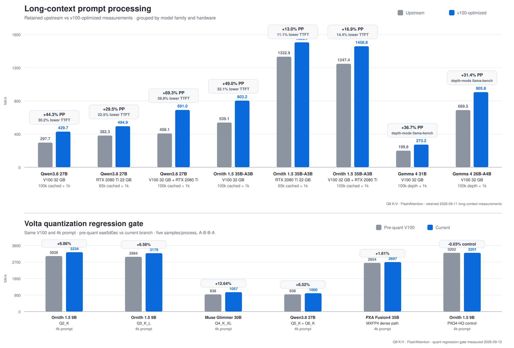

# llama.cpp for V100 and RTX 2080 Ti

CUDA paths tuned for long-context inference on NVIDIA **Volta (SM70)** and **Turing (SM75)**, tested on a Tesla V100-SXM2 32 GB and an RTX 2080 Ti 22 GB. The main Qwen setup uses Qwen3.8-27B `UD-Q5_K_XL` with llama.cpp `q8_0` K/V.



**Long-context highlights:** Qwen on V100 + RTX 2080 Ti reaches **+69.3% prompt processing** with **39.9% lower TTFT**; Ornith on V100 reaches **+49.0% PP** with **32.1% lower TTFT**; Qwen on V100 reaches **+44.3% PP** with **30.2% lower TTFT**.

**Branch:** `v100-optimized` · **Synced upstream:** `8172e6577` · **Benchmarked upstream runtime:** `43f3dda62` (2026-09-11)

## Benchmarks

The headline workload is **100,000 cached tokens followed by a 1,000-token prompt append**. Qwen uses `UD-Q5_K_XL`, `q8_0` K/V, FlashAttention, and MTP disabled on both engines. The benchmark report records the exact upstream revision, sync checks, and retained measurements.

### 100k cached + 1k append

| Hardware | Upstream PP | `v100-optimized` PP | PP gain | Upstream TTFT | `v100-optimized` TTFT | TTFT reduction |
|---|---:|---:|---:|---:|---:|---:|
| V100 32 GB | 297.69 tok/s | **429.66 tok/s** | **+44.33%** | 3.411 s | **2.380 s** | **-30.23%** |
| V100 + RTX 2080 Ti | 408.08 tok/s | **690.96 tok/s** | **+69.32%** | 2.505 s | **1.505 s** | **-39.93%** |

The V100 row uses native 131072 context and matched `batch=4096`, `ubatch=4096`. The dual-GPU row uses the production-style 409600-token YaRN context, a 4:5 RTX 2080 Ti:V100 tensor split, and `batch=4096`, `ubatch=2048`.

With 64 generated tokens after the dual-GPU append, generation improves from **23.97 to 26.50 tok/s (+10.56%)** and total request time falls from **5.141 to 3.889 seconds (-24.35%)**.

### RTX 2080 Ti: 65k cached + 1k append

The 22 GB RTX 2080 Ti can run the long-Q8 path at a 67,584-token context. Using 65,536 cached tokens leaves enough room for a 1,000-token append and directly exercises the Turing long-context kernel.

| Metric | Upstream `43f3dda62` | `v100-optimized` | Change |
|---|---:|---:|---:|
| Prompt processing | 382.30 tok/s | **494.92 tok/s** | **+29.46%** |
| TTFT | 2.656 s | **2.058 s** | **-22.53%** |
| 64-token decode | 17.30 tok/s | 17.34 tok/s | +0.19% |

The 67,584-token allocation leaves about 463 MiB free on the 22 GB card. Cold-prompt results follow below.

### Cold prompt processing

Cold PP shows the same comparison on fresh 1k and 16k prompts, using upstream `43f3dda62` and the launch settings documented below.

| Hardware | 1k upstream | 1k `v100-optimized` | Gain | 16k upstream | 16k `v100-optimized` | Gain |
|---|---:|---:|---:|---:|---:|---:|
| V100 32 GB | 859.13 | **904.11 tok/s** | **+5.24%** | 871.78 | **961.59 tok/s** | **+10.30%** |
| RTX 2080 Ti 22 GB | 670.74 | **925.19 tok/s** | **+37.94%** | 642.02 | **929.52 tok/s** | **+44.78%** |
| V100 + RTX 2080 Ti | 963.61 | **1088.98 tok/s** | **+13.01%** | 1025.85 | **1242.23 tok/s** | **+21.09%** |

Full methodology, regression checks and retained measurements are in [`benches/upstream-sync-0911/REPORT.md`](benches/upstream-sync-0911/REPORT.md).

## Build and run

### Build

Clone and build one binary containing both SM70 and SM75 kernels:

```bash
git clone --branch v100-optimized --single-branch https://github.com/mistrjirka/llama.cpp.git && cd llama.cpp && cmake -S . -B build -G Ninja -DCMAKE_BUILD_TYPE=Release -DGGML_CUDA=ON -DGGML_CUDA_GRAPHS=ON -DCMAKE_CUDA_ARCHITECTURES='70;75' -DLLAMA_BUILD_UI=OFF && cmake --build build -j --target llama-server
```

`70;75` builds kernels for both V100 and RTX 2080 Ti, so the same build works on either GPU or on a mixed system. `-DLLAMA_BUILD_UI=OFF` skips the web UI and its build/download step; remove it if you use the built-in UI.

The same CUDA build is recommended for Qwen and Ornith. On V100-containing systems, set `GGML_CUDA_VOLTA_FORCE_MMQ=moe`: it enables MMQ only for routed MoE experts and measured within 0.2% of normal dispatch on dense Qwen.

### V100

For Qwen3.8-27B on a single V100, the server automatically selects the measured `batch=4096`, `ubatch=4096` defaults when `-b/-ub` are omitted.
Replace the `CUDA_VISIBLE_DEVICES=0` index below with the `nvidia-smi` index of the card you want to expose. Once only one GPU is visible, llama.cpp sees it as `CUDA0`.

```bash
GGML_CUDA_VOLTA_FORCE_MMQ=moe CUDA_VISIBLE_DEVICES=0 ./build/bin/llama-server \
  --model /path/to/Qwen3.8-27B-UD-Q5_K_XL.gguf \
  --gpu-layers all \
  --ctx-size 131072 --parallel 1 \
  --flash-attn on \
  --cache-type-k q8_0 --cache-type-v q8_0
```

At 16k prompt processing, the measured V100 ubatch sweep was **876.49 tok/s at 1024**, **923.31 at 2048**, and **952.18 at 4096**.

### RTX 2080 Ti

For a single RTX 2080 Ti, the server automatically selects `batch=4096`, `ubatch=2048` for the tested Qwen3.8-27B model.

```bash
CUDA_VISIBLE_DEVICES=0 ./build/bin/llama-server \
  --model /path/to/Qwen3.8-27B-UD-Q5_K_XL.gguf \
  --gpu-layers all \
  --ctx-size 32768 --parallel 1 \
  --flash-attn on \
  --cache-type-k q8_0 --cache-type-v q8_0
```

At 16k prompt processing, `ubatch=1024/2048/4096` measured **890.95 / 923.63 / 930.62 tok/s**. `ubatch=2048` keeps almost all of the performance while leaving more VRAM for context and server state.

### V100 + RTX 2080 Ti

Batch/ubatch and tensor placement stay explicit on mixed-GPU systems because free VRAM, context size, and tensor split materially change the best configuration. The following is the tested 400k-context configuration used for the long-context benchmark. Check `./build/bin/llama-server --list-devices` first; the device order below assumes the RTX 2080 Ti is `CUDA1` and the V100 is `CUDA0`.

```bash
export GGML_CUDA_VOLTA_FORCE_MMQ=moe
export GGML_CUDA_ALLREDUCE=internal
export GGML_CUDA_AR_COPY_THRESHOLD=131072
./build/bin/llama-server \
  --model /path/to/Qwen3.8-27B-UD-Q5_K_XL.gguf \
  --device CUDA1,CUDA0 --tensor-split 4,5 --split-mode tensor \
  --gpu-layers all --fit off --parallel 1 \
  --ctx-size 409600 \
  --override-kv qwen35.context_length=int:409600 \
  --rope-scaling yarn --rope-scale 1.5625 --yarn-orig-ctx 262144 \
  --flash-attn on \
  --batch-size 4096 --ubatch-size 2048 \
  --cache-type-k q8_0 --cache-type-v q8_0 \
  --ctx-checkpoints 32 --checkpoint-min-step 8192
```

The tested 400k profile uses `4096/2048`. `ubatch=4096` was a little faster in the sweep but left only about 1 GiB free on the RTX 2080 Ti before adding other server state.

### Batch defaults

| Setup | Qwen3.8 default | Selection |
|---|---:|---|
| Single V100 | `4096/4096` | automatic |
| Single RTX 2080 Ti | `4096/2048` | automatic |
| V100 + RTX 2080 Ti, 409600 ctx | `4096/2048` | explicit tested profile |
| Other model/topology | upstream behavior | unchanged |

Explicit `-b/-ub`, `LLAMA_ARG_BATCH`/`LLAMA_ARG_UBATCH`, and non-default configuration values take precedence. `LLAMA_V100_AUTO_BATCH=0` disables the hardware-aware Qwen batch defaults. Automatic tuning is deliberately limited to the two benchmarked single-GPU types.

## RTX 2080 Ti optimizations

The RTX 2080 Ti path targets the parts of long-context attention where Turing differs from Volta.

### Long-Q8 attention dispatch

For the tested D256/GQA6 tensor-parallel geometry, Q8 K/V uses a dedicated `16x2` long-prompt attention specialization. This was the first large SM75 kernel improvement during the optimization work.

### INT8 Tensor-Core QK

The optimized path uses the existing `q8_0` K cache as the source data. K is packed into Tensor-Core-friendly INT8 codes and scales, Q is quantized once for the attention call, and the QK score calculation uses Turing's INT8 Tensor Cores. The mask, softmax, and value accumulation remain on the established attention path.


Together these paths produce the standalone RTX 2080 Ti long-context gain shown above while keeping decode performance unchanged.

## V100 optimizations

The Volta path lets long-context Q8 K/V use the compact V100 Tensor-Core attention specialization. Q8-backed KV is now eligible for the tuned compact kernel after conversion to the FP16 attention input.

The compact path remains specific to the validated long-context geometry. The regular FlashAttention dispatch handles other shapes.

## Ornith and MoE

Use the same build shown above. On V100 or a V100-containing system, set:

```bash
export GGML_CUDA_VOLTA_FORCE_MMQ=moe
```

This selects MMQ for routed expert matmuls on Volta. The setting is safe to keep in a shared launcher used for both dense Qwen3.8 and MoE models.

### Ornith 100k cached + 1k append

`Ornith-1.5-35B-A3B-AD-Q6_K-Q5_K.gguf`, one V100, Q8 K/V, MTP off:

| Metric | Upstream `43f3dda62` | `v100-optimized` + `MMQ=moe` | Change |
|---|---:|---:|---:|
| Prompt processing | 539.11 tok/s | **803.18 tok/s** | **+48.98%** |
| TTFT | 1.911 s | **1.299 s** | **-32.06%** |
| 64-token decode | 57.09 tok/s | 56.87 tok/s | -0.38% |

### Why use the selective MMQ setting

A mirrored Qwen test measured **429.86 PP/s** with the selector unset and **429.17 PP/s** with `GGML_CUDA_VOLTA_FORCE_MMQ=moe` (-0.16%). Dense Qwen has no routed experts, so the selector leaves its matmul policy unchanged.

Global `GGML_CUDA_FORCE_MMQ=ON` is much less suitable as a common build: the same Qwen 100k+1k test fell to **295.70 PP/s**, while Ornith measured **776.86 PP/s** globally forced versus **804.23 PP/s** with selective `MMQ=moe`. The normal build plus the runtime selector therefore gives the better shared Qwen/Ornith configuration.

The production MTP head is the Shisa 12K KL-distilled `mtp-shisa-ornith15-all-Q5_0.gguf`. A four-agent regression test with MTP3, Q8 target/draft KV, four 100k cached histories and `MMQ=moe` measured **89.35 → 89.46 generated tok/s aggregate (+0.13%)** across the upstream sync; mean per-agent TG was **27.85 → 27.90 tok/s** and draft acceptance **60.0% → 60.6%**. This confirms that the sync did not regress the production MTP path.

The tested Ornith Q6/Q5 model is about 25 GiB and fits on the V100 or the combined V100 + RTX 2080 Ti setup. Earlier MTP serving studies are under [`benches/mtp-final-integration-0907/`](benches/mtp-final-integration-0907/).

## Other fork features

The branch also contains earlier work on MTP serving, exact-prefix KV sharing, parked agent sessions, V100 FlashAttention/GatedDeltaNet tuning, PXQ, and mixed-GPU scheduling. These features have separate benchmarks and controls:

- [`benches/mtp-final-integration-0907/REPORT.md`](benches/mtp-final-integration-0907/REPORT.md)
- [`benches/parallel-serving-0907/RESEARCH.md`](benches/parallel-serving-0907/RESEARCH.md)
- [`benches/readme-current-0908/REPORT.md`](benches/readme-current-0908/REPORT.md)
- [`benches/upstream-vs-optimized-0911/REPORT.md`](benches/upstream-vs-optimized-0911/REPORT.md)
- [`benches/upstream-sync-0911/REPORT.md`](benches/upstream-sync-0911/REPORT.md)

## Benchmark notes

Benchmark percentages are measurements for the configurations above. Context length, quantization, tensor placement, batch size, and ubatch can move the bottleneck substantially. The current sync report contains the exact controls, retained measurements, MMQ comparison, and correctness checks used for the headline tables.

For general llama.cpp APIs, platform support, and build documentation, see upstream [`ggml-org/llama.cpp`](https://github.com/ggml-org/llama.cpp), [`docs/`](docs/), and [`tools/server/README.md`](tools/server/README.md).
