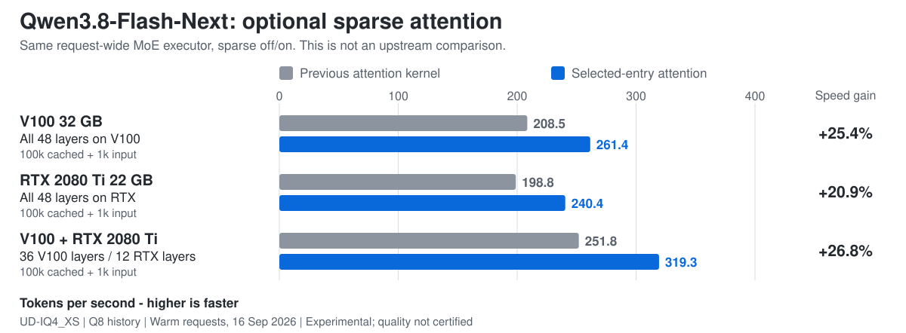

# llama.cpp for V100 and RTX 2080 Ti

This repository extends [llama.cpp](https://github.com/ggml-org/llama.cpp), an open-source C/C++ project for running language models on your own computer. It loads models from GGUF files and provides a command-line chat tool and a local server that other apps can send requests to. This fork includes llama.cpp itself; you build it instead of installing a separate extension.

The `v100-optimized` branch aims to make NVIDIA V100 and RTX 2080 Ti cards more useful for local AI: faster processing of long prompts, less waiting before an answer starts, and better use of GPU memory. It adds GPU kernels, model-specific defaults and mixed-GPU support. There is also an experimental path for large mixture-of-experts models that keeps some weights in system RAM.

The tested machines run Linux with CUDA 12.9, a V100 32 GB and an RTX 2080 Ti with **22 GB**, separately or together. The RTX measurements and memory presets are for that 22 GB card, not an 11 GB card.

[Build](#build) | [Qwen3.8 settings](#qwen38-settings) | [Flash-Next experiment](#qwen38-flash-next-experimental) | [Benchmarks](#benchmarks-and-validation)

## Performance

A model first reads your input, then writes an answer. **Prompt processing** measures the first part; **generation** measures the second. A token is a piece of text, often part of a word. In these graphs, higher tokens per second means faster processing.


The main workload adds 1,000 input tokens to a cached 100,000-token history. RTX-only rows use a 65,536-token history. These are published comparisons with upstream revision `3057bb66` from September 12, 2026, not promises for every model or the time to read a fresh 100k-token prompt. [Settings and results](docs/benchmarks/upstream-table.md). The newer [Flash-Next graph](#qwen38-flash-next-experimental) uses a separate comparison.

## Build

You need Git, CMake, Ninja, a C++ compiler, an NVIDIA driver and a CUDA toolkit that can compile for your GPU. CUDA 12.9 is the tested toolkit for this branch. Check `nvcc --version`; a recent driver alone does not install the CUDA compiler. See the [build guide](docs/build.md) for platform dependencies.

```bash
git clone --branch v100-optimized --single-branch \
  https://github.com/mistrjirka/llama.cpp.git
cd llama.cpp

cmake -S . -B build -G Ninja \
  -DCMAKE_BUILD_TYPE=Release \
  -DGGML_CUDA=ON \
  -DGGML_CUDA_GRAPHS=ON \
  -DCMAKE_CUDA_ARCHITECTURES='70;75' \
  -DLLAMA_BUILD_UI=OFF

cmake --build build -j 8 --target llama-server llama-cli
```

`70;75` builds GPU code for both V100 and RTX 2080 Ti. The resulting programs can use either card or both. Reduce `-j 8` when build memory is limited. `LLAMA_BUILD_UI=OFF` skips the browser UI download/build; the API server still works. Use `ON` to include the browser UI.

Download a GGUF model separately. The Qwen examples use `Qwen3.8-27B-UD-Q5_K_XL.gguf`; replace the example path with the file on your computer. The suffix identifies the model's quantization, a smaller representation of its weights. It is separate from the chat-history cache settings.

## Qwen3.8 settings

**Choose the model first.** Qwen3.8-27B and Qwen3.8-Flash-Next use different execution paths and memory layouts. This section starts with the 27B model. Flash-Next's optional expert-streaming setup has its own [section](#qwen38-flash-next-experimental).

### Start with one GPU

Check the device names:

```bash
./build/bin/llama-server --list-devices
```

Use the CUDA name printed for your card. The examples assume `CUDA0`; it is a device index, not a fixed name for a V100.

**V100 32 GB:**

```bash
./build/bin/llama-server \
  --model /path/to/Qwen3.8-27B-UD-Q5_K_XL.gguf \
  --alias qwen \
  --device CUDA0 --split-mode none \
  --gpu-layers all --fit off \
  --ctx-size 131072 --parallel 1 \
  --batch-size 4096 --ubatch-size 4096 \
  --flash-attn on \
  --cache-type-k q8_0 --cache-type-v q8_0 \
  --jinja --host 127.0.0.1 --port 8080
```

**RTX 2080 Ti 22 GB:** start at 32,768 tokens to leave more memory available.

```bash
./build/bin/llama-server \
  --model /path/to/Qwen3.8-27B-UD-Q5_K_XL.gguf \
  --alias qwen \
  --device CUDA0 --split-mode none \
  --gpu-layers all --fit off \
  --ctx-size 32768 --parallel 1 \
  --batch-size 4096 --ubatch-size 2048 \
  --flash-attn on \
  --cache-type-k q8_0 --cache-type-v q8_0 \
  --jinja --host 127.0.0.1 --port 8080
```

Once the server is ready, send a request from another terminal:

```bash
curl http://127.0.0.1:8080/v1/chat/completions \
  -H 'Content-Type: application/json' \
  -d '{"model":"qwen","messages":[{"role":"user","content":"Explain what a GPU does in two sentences."}],"max_tokens":128}'
```

For an API client, the base URL is `http://127.0.0.1:8080/v1` and the model name is `qwen`. The server is bound to your own computer. See the [server documentation](tools/server/README.md) before making it accessible over a network.

### What the settings do

| Setting | Meaning | When to change it |
|---|---|---|
| `--model` | The GGUF model file to load. | Use the exact file you downloaded. For a split GGUF, keep all parts together and point to the first part. |
| `--ctx-size` | Space for the conversation, input and generated answer, measured in tokens. | Choose the history length you need. A larger cache takes more memory; it does not make a short conversation faster. |
| `--batch-size` (`-b`) | Maximum input-token batch submitted to the model. | Start with 4096 for these 27B presets. This is not the number of users. |
| `--ubatch-size` (`-ub`) | Maximum input-token chunk processed at once on the GPU. | Use 4096 on V100 or 2048 on RTX. Smaller chunks need less working memory; larger chunks can improve prompt speed. Keep it no larger than `-b`. |
| `--cache-type-k q8_0 --cache-type-v q8_0` | Store the attention history in an 8-bit representation. | Keep both for the measured long-context presets. These flags do not change the model file's quantization. |
| `--parallel 1` | One active server slot. | Keep 1 for one conversation or agent. More slots share resources and need separate memory tuning. |
| `--device` / `--split-mode` | Which GPU does the work and how multiple GPUs share it. | Use one device with `none` for a single GPU; check device order before using a mixed preset. |
| `--gpu-layers all --fit off` | Request all model layers on the selected GPUs, without automatic fitting of unset settings. | Lower context or chunk size if memory runs out. Use fewer GPU layers or a smaller model when the weights themselves do not fit. |
| `--flash-attn on` | Use the GPU attention implementation used in the benchmarks. | Keep it enabled for these presets. |

The examples show batch sizes explicitly. The server also chooses these defaults for recognized Qwen3.8-27B configurations when you omit `-b` and `-ub`:

| Hardware | Context capacity | Batch / GPU chunk |
|---|---:|---:|
| V100 32 GB | 131,072 | 4096 / 4096 |
| RTX 2080 Ti 22 GB | 32,768 or 67,584 | 4096 / 2048 |
| V100 + RTX 2080 Ti | 409,600 | 4096 / 2048 |

The 67,584-token RTX profile has little memory headroom; it is the setting behind the 65k-history benchmark, not the starting command. Explicit arguments and environment/configuration values take priority. `LLAMA_V100_AUTO_BATCH=0` turns off the automatic Qwen batch selection.

### Longer context on two GPUs

The benchmarked 27B configuration splits each layer's calculation across both GPUs. The device list and `--tensor-split` ratios have the same order. In the example, `CUDA1` is the RTX and `CUDA0` is the V100, so `4,5` assigns a larger share to the V100.

<details>
<summary>Advanced: the tested 409,600-token Qwen3.8-27B configuration</summary>

```bash
GGML_CUDA_ALLREDUCE=internal \
GGML_CUDA_AR_COPY_THRESHOLD=131072 \
./build/bin/llama-server \
  --model /path/to/Qwen3.8-27B-UD-Q5_K_XL.gguf \
  --alias qwen \
  --device CUDA1,CUDA0 --tensor-split 4,5 --split-mode tensor \
  --gpu-layers all --fit off --parallel 1 \
  --ctx-size 409600 \
  --override-kv qwen35.context_length=int:409600 \
  --rope-scaling yarn --rope-scale 1.5625 --yarn-orig-ctx 262144 \
  --flash-attn on \
  --batch-size 4096 --ubatch-size 2048 \
  --cache-type-k q8_0 --cache-type-v q8_0 \
  --ctx-checkpoints 32 --checkpoint-min-step 8192
```

`GGML_CUDA_ALLREDUCE=internal` selects the fork's built-in method for combining work from the GPUs. The YaRN flags extend the position range beyond the model's original 262,144-token setting; a successful speed test does not establish answer quality at every extended length. The `qwen35` key is the model's GGUF architecture metadata name. Checkpoints retain recurrent state to help reuse an earlier part of the conversation and also consume memory.

This is a specific two-card preset for the 27B model, not a Flash-Next preset. Keep the ordinary one-GPU setup until you need the extra capacity.

</details>

### Which extra switches are needed?

For Qwen3.8-27B, the normal CUDA build and the command for your GPU are enough. The relevant attention kernels are chosen automatically. **Do not use a global `GGML_CUDA_FORCE_MMQ=ON` build for this dense model:** the measured Qwen setup was slower with that policy. `GGML_CUDA_VOLTA_FORCE_MMQ=moe` affects routed experts, so it is useful for some MoE models but does not accelerate dense Qwen.

Multi-token prediction (MTP) uses a draft to propose tokens that the main model verifies. It is optional and was disabled in the upstream-comparison benchmarks. It needs its own model-specific setup; it is not required for these commands or supported by the experimental full-request Flash-Next server path.

## Qwen3.8-Flash-Next (experimental)

A mixture-of-experts (MoE) model selects parts of the model, called experts, for each token. When its weights exceed GPU memory, copying the same experts from RAM for every input chunk can be expensive. This fork's **request-wide prefill** processes one layer across the complete new prompt, so an uploaded expert can serve all the tokens that need it before its GPU buffer is reused. The repeatedly used token state stays in GPU memory.

The optional **selected-entry attention** kernel computes the model's existing sparse attention directly. For identical inputs it uses the same selected history entries, rather than imposing another lossy attention-selection rule. Arithmetic differs from the previous kernel, and model outputs can change; the [numerical audit](benches/moe-prefill-0916/NUMERICS.md) describes the remaining precision issue.



These September 16 checks on the merged source use `UD-IQ4_XS`, Q8 history, a restored 100k-token prefix and 1,000 new C++ input tokens. Both bars use the new request-wide executor. They are **not upstream comparisons** or generated-token speeds. Loading, prefix restoration and first expert-cache population are outside the warm-request timings. See [raw results and methodology](benches/moe-prefill-0916/MERGE.md).

### Flash-Next settings

This path is opt-in and separate from the normal 27B server settings. The benchmark runner groups the tested options into named presets:

```bash
python3 benches/moe-prefill-0916/run.py \
  --preset v100 \
  --model /path/to/Qwen3.8-Flash-Next-UD-IQ4_XS-00001-of-00003.gguf \
  --build build \
  --output results/flash-next-v100
```

The starting test processes 4,096 new tokens without a saved prefix. Use `--preset rtx2080ti` for the 22 GB RTX or `--preset v100-rtx2080ti` for the mixed system. The runner selects matching cards, prints the chosen devices, compiles its test executable against your build, and saves commands and results. [Long-context reproduction and the full option list](docs/moe-prefill.md).

| Setting | What it controls |
|---|---|
| `LLAMA_MOE_LAYER_FIRST=1` | Enables request-wide expert scheduling. It is disabled in ordinary launches. |
| `LLAMA_MOE_LAYER_FIRST_DEVICE_MIB=3072` | The per-device budget used to plan new-token working state and optional extra expert caching. It is not a limit on the whole model or the history cache. |
| `LLAMA_MOE_LAYER_FIRST_BASE_LAYERS_0` / `_1` | Base expert-cache allowances on the first and second layer devices. More cached weights can reduce RAM transfers, but leave less memory for other work. The tested bases are 14 on one V100, 6 on one RTX, or 16/10 on the mixed pair. |
| `QWEN4EXP_QSA_SPARSE_ATTN=1` | Enables the selected-entry attention candidate at long history. It is off by default; the benchmark runner compares both settings. |

Those four settings explain the main choices; they are **not a complete server-launch preset**. The runner supplies the additional validated scheduling options. The experiment needs substantial system RAM, one text sequence and CUDA layer placement. The third device's base-cache allowance is not yet configurable; two/three logical-device checks are not physical multi-V100 benchmarks. See [support limits](docs/moe-prefill.md#support-and-memory-limits).

## What else this fork changes

The attention work covers long conversations on Volta and Turing. The fork also accelerates conversion of several quantized weight formats on V100, selects different matrix routines for routed experts, and includes mixed-GPU and shared-prefix serving work. The measured benefits depend on the model and shape of the request.

For Ornith, use the [Ornith and multi-slot guide](docs/gpu-tuning.md). It includes the separate RTX FORCE_MMQ build and the four-slot MTP example. Those settings are not interchangeable with dense Qwen or Flash-Next.

## Benchmarks and validation

[Upstream comparison and exact settings](docs/benchmarks/upstream-table.md) | [Flash-Next portability](benches/moe-prefill-0916/HARDWARE.md) | [Flash-Next numerical audit](benches/moe-prefill-0916/NUMERICS.md)

<details>
<summary>Generation speed after the long-context input</summary>


These runs generate 128 tokens. Most single-GPU generation rates were close to upstream; the larger gains were in prompt processing. The [upstream-sync report](benches/upstream-sync-0912/REPORT.md) records revisions, model files, settings and token-hash checks.

</details>

[Quantization-kernel checks](benches/volta-kquant-0912/ADDITIONAL_FORMATS.md), [saved-state correctness](benches/correctness-0912/nondeterminism/REPORT.md) and the [merge validation record](benches/moe-prefill-0916/MERGE.md) cover different test scopes. Sparse-attention quality and the inherited FP32-request/FP16-value-accumulator mismatch remain open; merging the code does not enable the experiment by default.

## Help and upstream

Use the [llama.cpp documentation](docs/) and [server API reference](tools/server/README.md) for general usage. Report fork-specific problems in this repository's [issue tracker](https://github.com/mistrjirka/llama.cpp/issues), including the commit, GPU, CUDA version, model filename and launch command. Remove credentials and private prompts from logs before sharing them.

The base project is maintained by [ggml-org/llama.cpp](https://github.com/ggml-org/llama.cpp); this fork is maintained by [mistrjirka](https://github.com/mistrjirka). The upstream sync included here is `3057bb66` from September 12, 2026. See [LICENSE](LICENSE) and [CONTRIBUTING.md](CONTRIBUTING.md).
