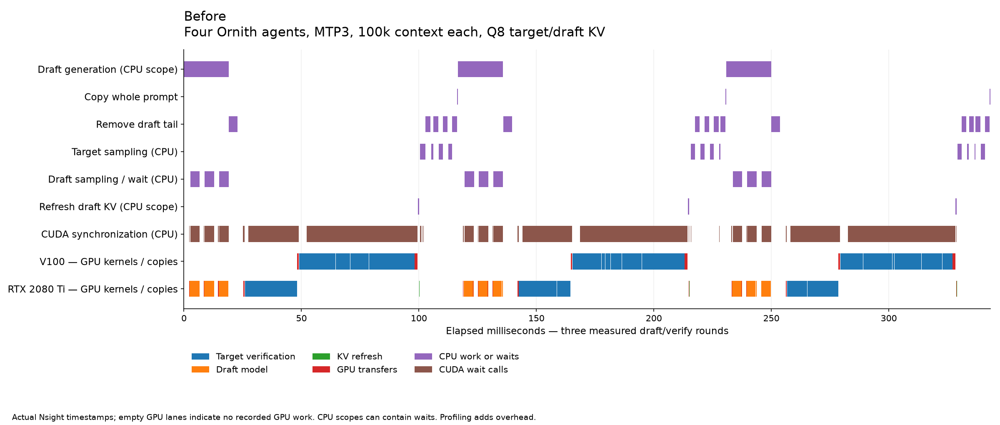
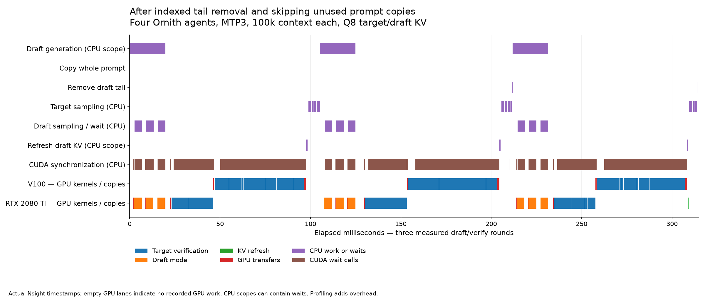

# MTP CPU-stall investigation — 7 September 2026

## What changed

During speculative rejection/cleanup, removing a few tokens used to scan the entire reserved KV pool. The new path uses the existing per-sequence ordered position index and visits only cells in the requested interval. It preserves shared-cell ownership, duplicate logical positions, free-cell head selection, and the original path for all-sequence removal. It creates no extra index, does not move K/V tensors, and does not change attention arithmetic or cache precision.

The second change skips copying the whole prompt for a sole MTP implementation: that drafter reads token IDs, hidden carry and cached state instead. A valid empty vector remains for generic diagnostics. Other speculative methods and method combinations retain their original prompt-copy path.

These exact CPU changes were measured on source base `f9d1c3a2b` (runtime-identical to production `5a1e654a2`) and preserved as `8ef021edd`. They are integrated with per-request warm pause/resume separately; see [final integration](../mtp-final-integration-0907/REPORT.md). The older direct-Q8 attention, compact-first physical placement and sequence-grouping prototypes are not included.

## Measured serving results

V100-SXM2 32 GiB at 200 W + modified RTX 2080 Ti 22 GiB at 250 W; Ornith AD-Q6_K-Q5_K target, Shisa Q5_0 MTP head, Q8 target/draft K/V, CPU projector, 1.4M physical pool / four logical 400k slots. Actual histories contain 100k C++ source tokens each, sharing roughly 98k. Requests add 38/42/44/41 tokens and generate 128 per active agent. Model loading and restore are excluded; prompt append and generation are included. This is not a four-full-400k test or a new 350k benchmark.

Four retained turns per arm, with excluded process warmups and mirrored arm order. No profiler or compiler runs during serving timings. A small sample and unlocked GPU clocks do not establish universal speedups. Per-agent TG is not aggregate throughput.

| Four active agents | Complete turn | TG per agent |
|---|---:|---:|
| True MTP off | 5.714 s | 26.20 tok/s |
| Previous MTP3 | 6.340 s | 24.61 tok/s |
| Skip prompt copy only | 6.322 s | 24.53 tok/s |
| Indexed removal only | 5.777 s | 27.19 tok/s |
| Both changes, MTP3 | **5.616 s** | **27.81 tok/s** |

Both changes reduce MTP3 turn latency by **11.41%**, increasing per-agent TG by **13.02%**. The small ~1.7% whole-turn advantage over MTP-off is near break-even, not a general claim that MTP always wins. Individual ablation percentages must not be added. Prompt-copy removal alone is within noise; indexed removal provides the clear main benefit.

For one active MTP3 agent (four histories still resident), turn time is **2.646 → 2.497 s** (5.63% shorter) and TG **53.47 → 57.14 tok/s** (6.87% higher). A separate MTP-off control is effectively unchanged: 5.681 → 5.696 s, with overlapping ranges. See the raw and summary JSON files for all runs.

## What Nsight found

In the four-agent baseline capture, 551 KV-removal calls span **554.137 ms**, all overlapping empty GPU lanes. The indexed follow-up capture has 578 calls spanning **3.954 ms**, likewise CPU work. The counts differ because concurrent request admission changes the execution schedule, so this is stage attribution, not a paired fixed-step latency benchmark. Mean call time falls from approximately 1.006 to 0.00684 ms.

The measured interval with neither GPU executing recorded kernels/copies falls from **29.56% to 22.35%**. Much of the removed idle time is explained by the full-pool scans. Conversely, nearly all CPU synchronization duration overlaps necessary GPU work; deleting synchronization calls wholesale would not recover their summed duration.

These are separate instrumented captures. Profiling overhead and summed kernel times are not the unprofiled end-to-end rates above. No GPU-overlap improvement is fabricated from CPU scope duration.

### Before

### After

GPU bars show actual kernels and copies; CPU scope bars can include waiting. Blank GPU regions mean no recorded GPU activity, not proof that every such interval can be removed. The zoom selects three measured draft/verification rounds; it does not align arbitrary durations to imply identical token trajectories.

## Correctness

The differential cache-index test covers 100,000 randomized state mutations, 25,035 random interval removals, duplicate positions, shared ownership, shifts, division, copy/move, and full sequence deletion. It checks 61,611,394 conditions against the original scan; AddressSanitizer/UndefinedBehaviorSanitizer report no errors. The test is also registered with CTest.

Independent whole-server baseline/enabled/disabled runs match all four output sequences, draft/acceptance counts, raw target/draft/speculative snapshots and restored continuation. Qwen built-in-MTP checks and parked-bank process restart checks passed. The final combined build is rechecked in the integration report; neither a lower-precision cache nor changed attention arithmetic is used to obtain the gains.

## Evidence

`manifest.json` identifies the retained source, JSON and image evidence and the location of the large Nsight traces in the persistent sandbox. Profiling markers are separate interposers and must not be loaded during timing or production serving. The scripts deliberately refer to the original immutable experiment directory; they must not overwrite a running production executable. Reproduction on another system requires the same model and source-token/snapshot fixtures, or newly documented fixtures and binary hashes.
